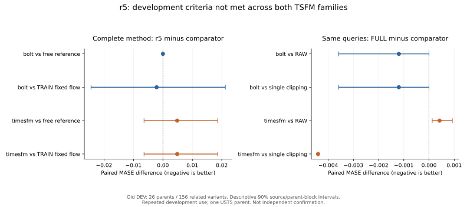

# r5 方法与论证正文（供论文生成器引用）

## 研究问题与可观测状态

给定预测时点 t 前可获得的多变量输入 X、观测掩码 M、可用时间元数据及预测跨度 H，冻结基础模型 F 的参数。治理动作 a 只修改允许填补的输入位置，生成合法版本 X^(a)，随后取得当前任务预测 p_a=F(X^(a))。有效观测不覆盖；完整有效目标按契约直接 KEEP。Native KEEP、FFILL、单变量 TS-ICL、多变量 TS-ICL、context ridge 构成固定动作目录；不支持的动作保留请求身份、实际别名与费用。

部署状态只包括当前免费描述、已经执行版本的预测和已付成本。未来目标、未来评分mask及未执行候选预测不能进入此状态。历史probe的内部任务与当前L512/H96或H192任务不等同。这里的任务是选择输入版本，不是预测器路由或预测融合。

训练和几何计算使用当前origin可见的正尺度 S_t；对外报告另用外层TRAIN冻结的MASE分母。前者按可见季节差分对、lag-1差分、MAD及固定下限顺序确定，记录支持和回退。两者不互换；历史预测的输入处理不得使用更晚origin的尺度。

## 当前任务响应与收益评分

免费参考策略首先选择并真实执行 a_0。对已查询候选 a，七项响应为 p_a−p_0 的有符号均值、平均绝对值、最大绝对值、前半/后半平均绝对值、沿lead线性趋势及末lead差，均除以 S_t。原始收益评分器采用动作截距和共享ridge斜率，监督是合法TRAIN当前任务的 MAE(p_0)−MAE(p_a)，再除以 S_t。预测差特征和任务收益监督各有先例；它们本身不构成原创主张。

免费参考在fit内按同来源、完整读取区间和parent进行forward/purge交叉拟合。未来监督区间必须在被预测训练parent的读取起点之前；相关变体不跨组。同来源较早TRAIN支持不足16parent时使用登记回退，不使用本parent标签补支持。最终参考与评分器只用fit，正则0.1/1/10与调用价格0/0.01/0.1在gate选择；每家族规则相同、参数分别拟合。源、parent、变体逐层等权，重复扰动不扩张parent支持。

## 无未来标签的收益向量约束

对已查询集合 Q，参考编号为0。令

\[
\ell(p,y)=\sum_{h=1}^{H}w_h|p_h-y_h|/S_t,\qquad
 g_a(y)=\ell(p_0,y)-\ell(p_a,y),\quad g_0=0.
\]

权重非负、和为1，且各动作使用同一目标和同一评分规则。若权重在预测前未知，不以查看未来有效mask确定它们。

绝对损失给出必要距离约束 |g_a−g_b|≤D_ab。已知固定权重时 D_ab 为加权预测绝对距离；未知评分位置时使用 max_h|p_a,h−p_b,h|/S_t。单臂区间截断和全部成对距离约束作为独立简单对照。

对每个lead，在所有已查询预测值 b 处构造折点向量

\[
 v_{h,b,a}=(|p_{0,h}-b|-|p_{a,h}-b|)/S_t.
\]

实际lead收益曲线在相邻折点间线性、两端常数。因此所有可能真实收益都在这些折点的凸包内。已知固定权重时使用各lead凸包的加权Minkowski和 C；未知权重时使用全部lead折点的共同凸包 C_unknown。后者允许更宽的收益组合，代价是约束更保守。这里是包含真实收益的凸可行外包，不声称每个凸组合都对应某个实际未来序列。

将原始评分 r 投影到对应集合，仅校正评分，不修改任何预测。参考坐标保持0；校正收益最大者若非正则保留参考。其余并列采用预登记动作顺序。最终输出始终为一个已执行版本的原生预测。

## 数值求解与性质

主实验使用unknown集合。Frank–Wolfe初始化 z=0；每个lead最小/最大折点向量互为相反数，因而0属于其凸包。线性oracle按当前梯度选折点，已知权重时逐lead选择后加权求和，未知权重时在全部折点中选一个。令 d=s−z、gap=〈z−r,z−s〉，精确线搜索步长为 clip(gap/||d||²,0,1)。实现固定最多2048次迭代、gap容差1e-8、每次求解配置0.05秒软时限，并记录实际gap、耗时和状态；逐迭代检查不能抢占正在进行的NumPy/SLSQP调用，因此不是硬实时上界。

对任意集合内真实收益g，精确欧氏投影 z 满足

\[
\|z-g\|^2\le\|r-g\|^2-\|r-z\|^2.
\]

理由是投影的一阶最优条件 〈z−r,g−z〉≥0，加上范数展开。对FW可行近似解，有 〈z−r,g−z〉≥−gap，同样展开得到右侧增加2gap的关系。凸投影及FW为已有数学工具；该性质仅控制整个向量平方误差，不保证逐坐标误差、动作排名、MASE或逐请求无害。迭代上限返回带gap近似；超时和非有限输入导致保留上次有效决策并停止。

两个不同预测时约束可能退化为区间。高阶证据必须在至少三个数值不同预测的共同支持子集分析；不同dtype/hash不自动计为不同预测。

## 选择性执行与完整费用

预查询先验 μ_a 只读免费信息和已执行参考预测。当前已查询最大校正收益为m，下一动作按 μ_a−m−λC_est(a) 排序。只有该值为正且整个分支可容纳于剩余预算时才执行，否则STOP。主候选最多参考加两个候选动作请求；别名或相同输入去重后独特预测可能少于三个；该规则是成本敏感启发式，不是最优信息价值定理。

可执行步骤如下：

1. 计算合法免费状态与S_t；完整输入选择KEEP，否则由冻结免费参考选择动作。
2. 物化并执行参考预测，记录实际输入、mask、checkpoint/revision、dtype与费用。
3. 在尚未执行动作中，使用先验及完整预计分支费用检查是否继续。
4. 仅在实际执行成功后揭示新预测，计算当前任务响应和联合评分；更新可提交动作。
5. 达到版本上限、下一可行候选的先验净效用非正、预算不足或执行/求解失败则停止，输出上次有效已执行预测。已查询最大校正收益非正只使当前提交保持参考，不单独禁止继续查询。

费用包括预处理、策略、物化、模型、求解和输出。每新增候选预留0.051秒决策/求解费用，输出另预留0.001秒。物化后才可按真实输入身份共享预测；未查询候选不能通过缓存先泄露。已发生成本不在最终动作排名中再次惩罚。预算不足以支付首个预测时仍报告预算未满足，不将STOP算成零费用。预计费用不能保证真实墙钟；超支、首次惰性分支和失败费用完整保留。

## 证据层级与当前否定结果

共同开发比较回答三件不同的事：相同查询集合下评分约束是否有增量；相同复用条件下选择性执行是否优于固定流程；完整方法是否优于TRAIN预先选定强简单对照。r5在这些开发门槛上没有取得共同支持。Bolt完整方法等于免费参照；TimesFM完整方法弱于免费流程；固定轨迹投影虽降低向量误差，却在TimesFM上恶化最终MASE。不会将自然调用或可行oracle空间替代方法收益。

旧DEV只有26parent，并已反复使用；描述性区间按来源和parent块处理相关变体，不解释为新确认检验。金融仅两个parent且部分重叠旧DEV，无可验证自然缺口，无法支持金融泛化。公开主矩阵准备和后续强基线复核不改变这些边界。只有新候选将来按原登记满足条件并冻结后，才能依既定规则进入独立确认；本轮不解封。

## 共同统计图

图由同一统计JSON生成，没有额外训练或选择窗口。区间仅对已观察来源内部的parent时间块重采样；USTS只有一个parent，无法估计该来源的时间不确定性。部分区间退化成点反映支持不足，不能解释为没有不确定性。脚本为`v431_r5_plot.py`，保留PDF/SVG及对应数值和输入hash。
